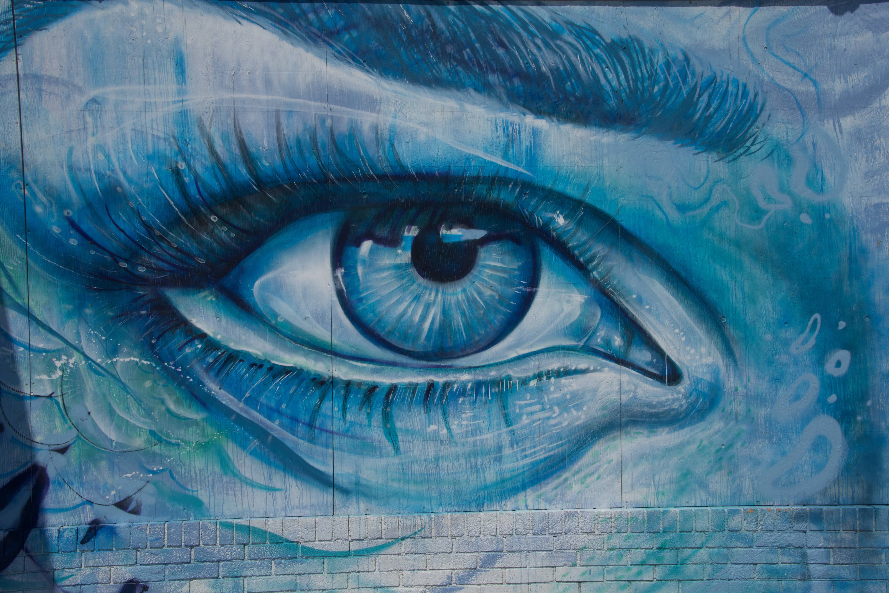
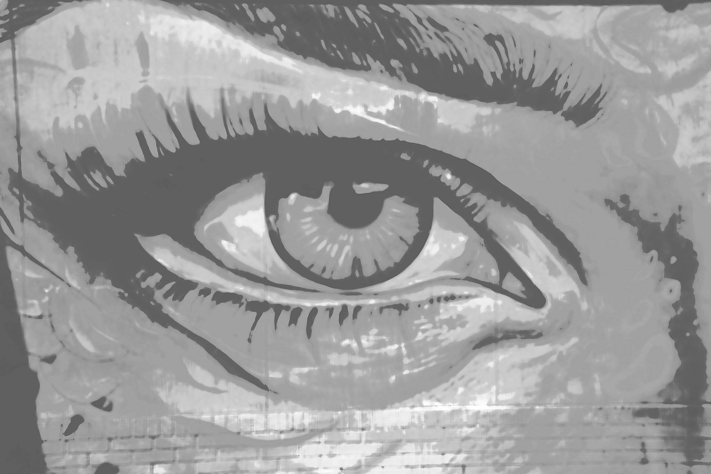

 Original image source: https://photos.smugmug.com/photos/i-d8GtN8W/0/5K/i-d8GtN8W-5K.jpg

 
 Transformations performed:

 Colorize (magick) -> Color: #d609a8 | Opacity 32% 
 Quantize (magick) -> Max Colors in Image: 11 
 Modulation (magick) -> Brightness: 121 | Saturation: 100 | Hue: 39 
 Median (magick) -> Pixels: 22 
 Sketching (sketcher) -> Style: 2 | Lineweight: 1 | Contrast: 58 | Shadow: 0.790528465993702 | Gain: 0.915981706231833 
 

