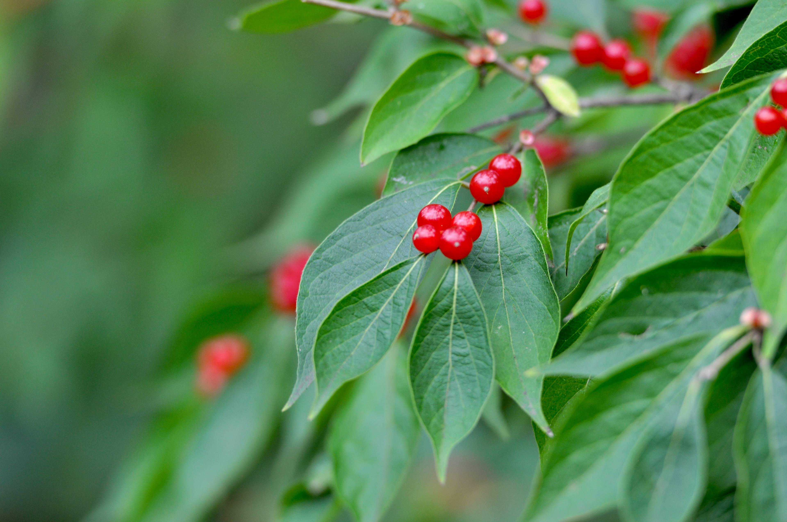

For details on the nuts and bolts behind this project, see {target = "_blank"} ---
title: Random Manipulation of a Random SmugMug Image
author: Tim Wilson
date: 2021-11-14
slug: random-image-i-FFdzxhX-4K
categories:
  - R
tags:
  - Github Actions
  - SmugMug
  - Twitter
  - ImageMagick
type: image-randomization
---

 Original image source: https://photos.smugmug.com/photos/i-FFdzxhX/0/4K/i-FFdzxhX-4K.jpg

 {width=100%}

 Transformations performed:

 * Median (magick) -> Pixels: 31 

The resulting image:

 {width=100%}

