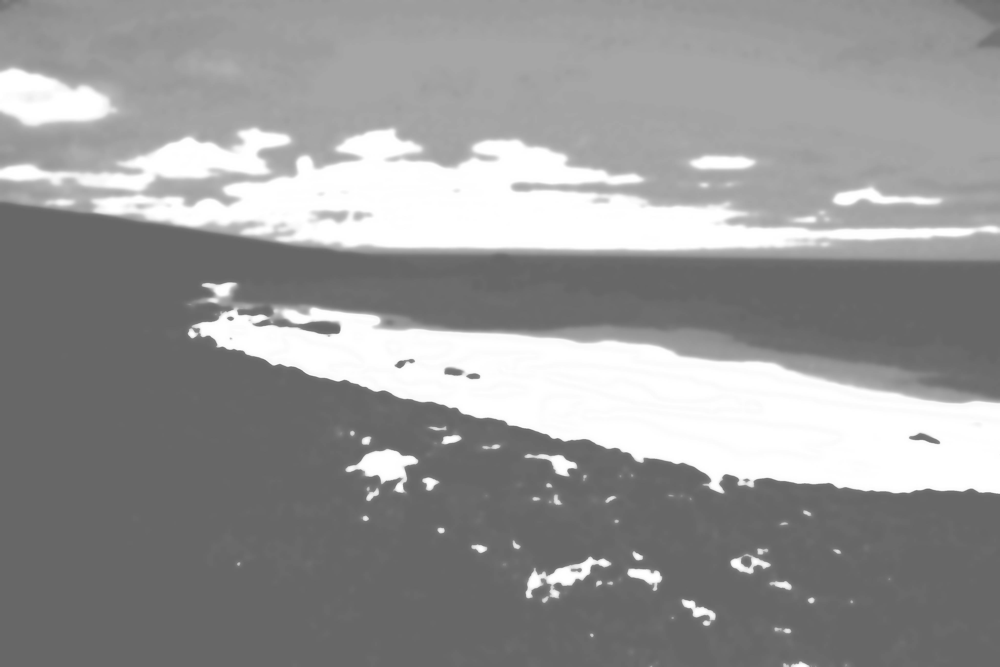

 For details on the nuts and bolts behind this project, see <a href="post/2021/11/07/random-image-manipulation/" target = "_blank">this post</a>.
 Original image source: https://photos.smugmug.com/photos/i-SBGLgPX/0/5K/i-SBGLgPX-5K.jpg

 {width=100%}

 Transformations performed:

 * Quantize (magick) -> Max Colors in Image: 4 
 * Colorize (magick) -> Color: #c1aa1b | Opacity 39% 
 * Median (magick) -> Pixels: 28 
 * Modulation (magick) -> Brightness: 112 | Saturation: 88 | Hue: 165 
 * Sketching (sketcher) -> Style: 2 | Lineweight: 3 | Contrast: 22 | Shadow: 0.62063321005553 | Gain: 0.959875554777682 

The resulting image:

 {width=100%}

