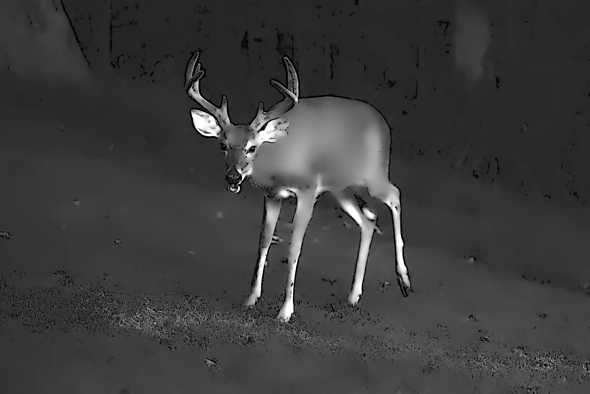

 For details on the nuts and bolts behind this project, see <a href="post/2021/11/07/random-image-manipulation/" target = "_blank">this post</a>.
 Original image source: https://photos.smugmug.com/photos/i-jtLr8rC/0/4K/i-jtLr8rC-4K.jpg

 {width=100%}

 Transformations performed:

 * Modulation (magick) -> Brightness: 122 | Saturation: 107 | Hue: 16 
 * Sketching (sketcher) -> Style: 1 | Lineweight: 6 | Contrast: 45 | Shadow: 0.76334183011204 | Gain: 0.00278255925513804 

The resulting image:

 {width=100%}

