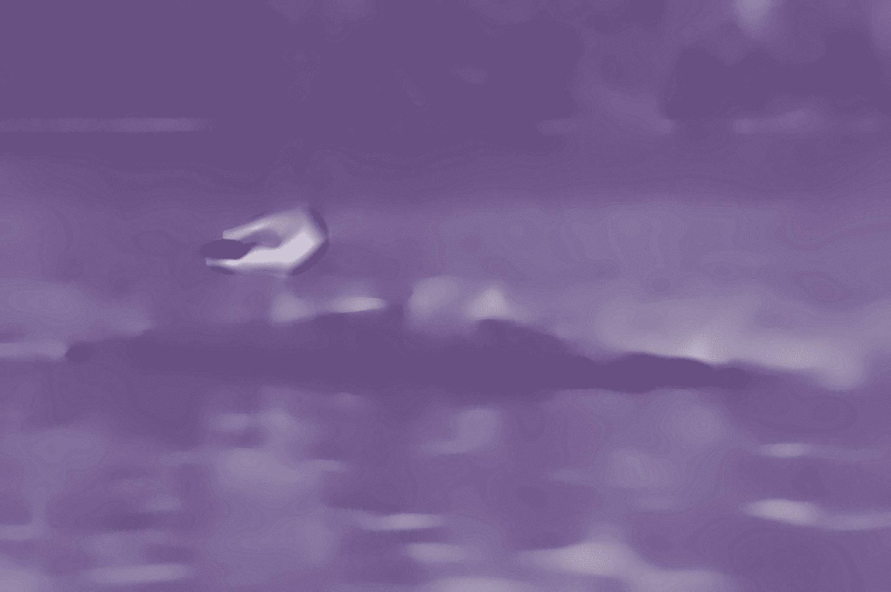

 Original image source: https://photos.smugmug.com/photos/i-t3QZL7T/0/X4/i-t3QZL7T-X4.jpg

 {width=100%}
 Transformations performed:

 * Median (magick) -> Pixels: 38 
 * Sketching (sketcher) -> Style: 2 | Lineweight: 6 | Contrast: 54 | Shadow: 0.835227042902261 | Gain: 0.516156727913767 
 * Colorize (magick) -> Color: #3ebbbc | Opacity 42% 
 * Modulation (magick) -> Brightness: 134 | Saturation: 70 | Hue: 148 
 * Quantize (magick) -> Max Colors in Image: 6 

The resulting image:

 {width=100%}{id="final"}

