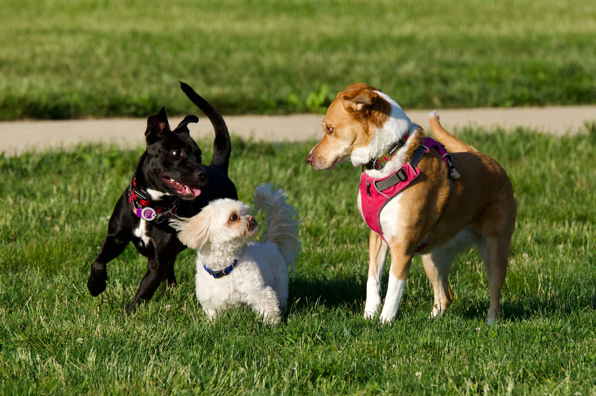
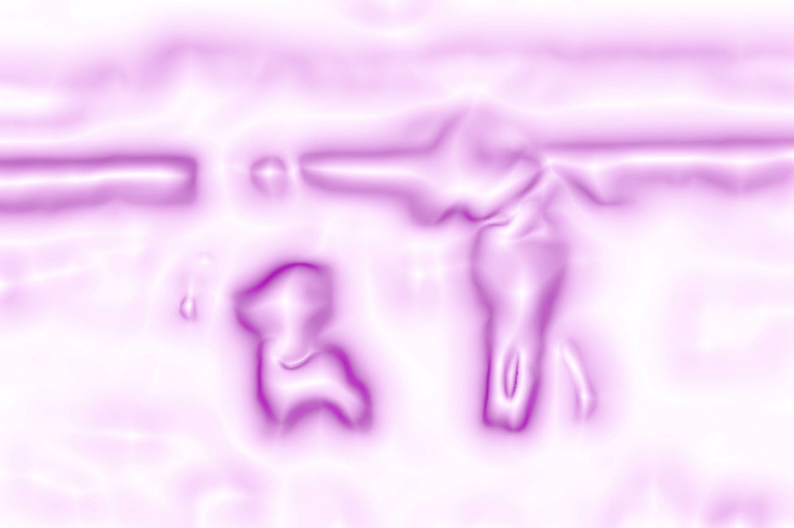

 For details on the nuts and bolts behind this project, see <a href="/post/2021/11/07/random-image-manipulation/" target = "_blank">this post</a>.
 Original image source: https://photos.smugmug.com/photos/i-CsS73hq/0/X5/i-CsS73hq-X5.jpg

 {width=100%}

 Transformations performed:

 * Quantize (magick) -> Max Colors in Image: 4 
 * Median (magick) -> Pixels: 43 
 * Sketching (sketcher) -> Style: 2 | Lineweight: 6 | Contrast: 42 | Shadow: 0.0586158989463001 | Gain: 0.463664996670559 
 * Colorize (magick) -> Color: #3de672 | Opacity 49% 
 * Modulation (magick) -> Brightness: 126 | Saturation: 134 | Hue: 187 

The resulting image:

 {width=100%}

