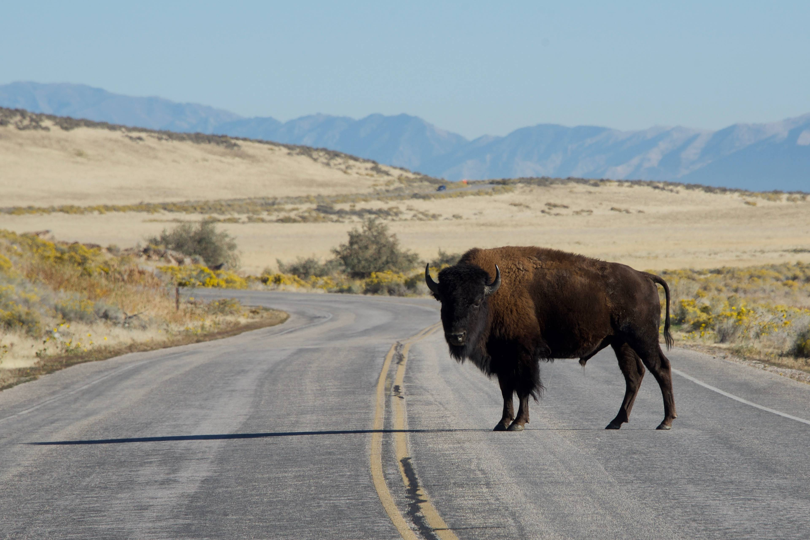
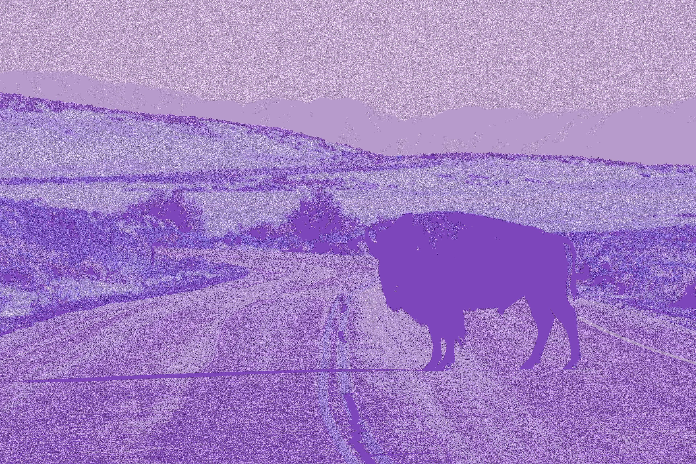

 For details on the nuts and bolts behind this project, see <a href="/post/2021/11/07/random-image-manipulation/" target = "_blank">this post</a>.
 Original image source: https://photos.smugmug.com/photos/i-QsCjbBh/0/4K/i-QsCjbBh-4K.jpg

 {width=100%}

 Transformations performed:

 * Colorize (magick) -> Color: #469223 | Opacity 55% 
 * Quantize (magick) -> Max Colors in Image: 13 
 * Modulation (magick) -> Brightness: 143 | Saturation: 130 | Hue: 195 

The resulting image:

 {width=100%}

