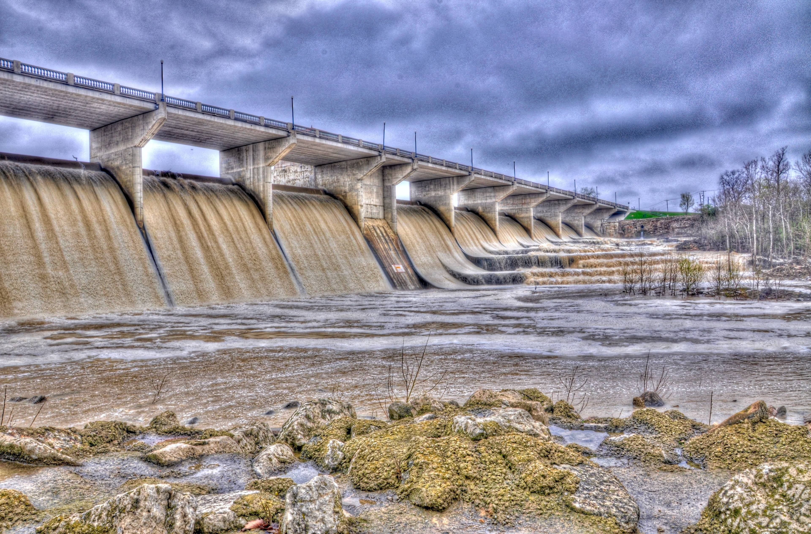

 For details on the nuts and bolts behind this project, see <a href="/post/2021/11/07/random-image-manipulation/" target = "_blank">this post</a>.
 Original image source: https://photos.smugmug.com/photos/i-RJMqxHG/0/4K/i-RJMqxHG-4K.jpg

 {width=100%}

 Transformations performed:

 * Quantize (magick) -> Max Colors in Image: 15 
 * Modulation (magick) -> Brightness: 119 | Saturation: 126 | Hue: 26 
 * Sketching (sketcher) -> Style: 2 | Lineweight: 1 | Contrast: 45 | Shadow: 0.573412964120507 | Gain: 0.920277415541932 

The resulting image:

 {width=100%}

