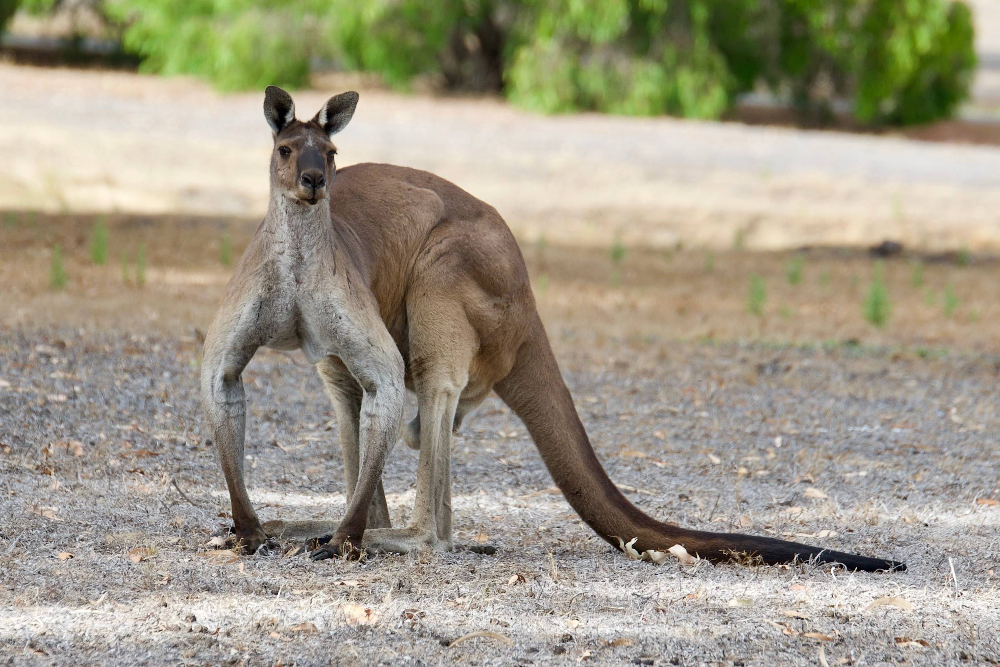

 For details on the nuts and bolts behind this project, see <a href="/post/2021/11/07/random-image-manipulation/" target = "_blank">this post</a>.
 Original image source: https://photos.smugmug.com/photos/i-SHtWBcV/0/X5/i-SHtWBcV-X5.jpg

 {width=100%}

 Transformations performed:

 * Median (magick) -> Pixels: 48 

The resulting image:

 {width=100%}

