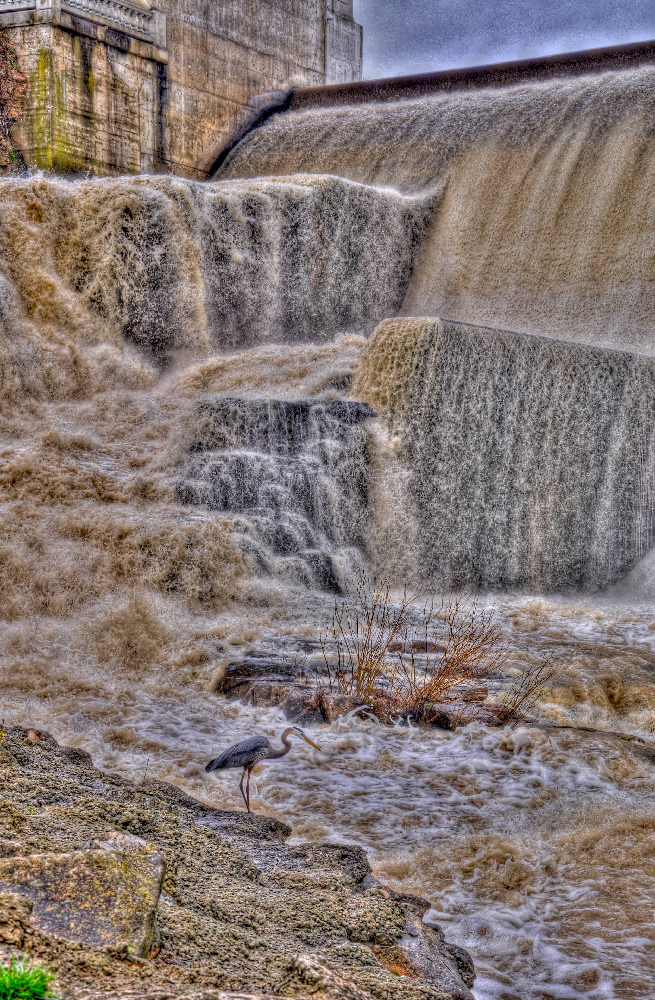

 For details on the nuts and bolts behind this project, see <a href="/post/2021/11/07/random-image-manipulation/" target = "_blank">this post</a>.
 Original image source: https://photos.smugmug.com/photos/i-TV8Z4Cj/0/4K/i-TV8Z4Cj-4K.jpg

 {width=100%}

 Transformations performed:

 * Quantize (magick) -> Max Colors in Image: 8 
 * Median (magick) -> Pixels: 32 
 * Colorize (magick) -> Color: #33c47e | Opacity 35% 
 * Modulation (magick) -> Brightness: 102 | Saturation: 61 | Hue: 9 
 * Sketching (sketcher) -> Style: 1 | Lineweight: 4 | Contrast: 45 | Shadow: 0.130427276249975 | Gain: 0.433415808016434 

The resulting image:

 {width=100%}

