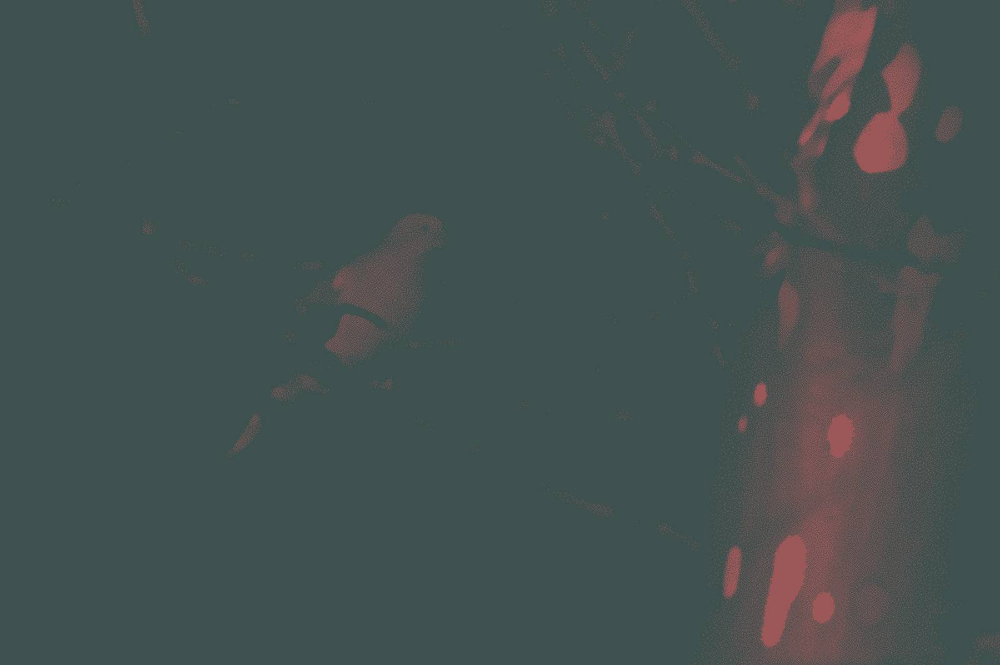

 For details on the nuts and bolts behind this project, see <a href="/post/2021/11/07/random-image-manipulation/" target = "_blank">this post</a>.
 Original image source: https://photos.smugmug.com/photos/i-fJDKncS/0/X3/i-fJDKncS-X3.jpg

 {width=100%}

 Transformations performed:

 * Modulation (magick) -> Brightness: 74 | Saturation: 74 | Hue: 79 
 * Median (magick) -> Pixels: 17 
 * Quantize (magick) -> Max Colors in Image: 5 

The resulting image:

 {width=100%}

