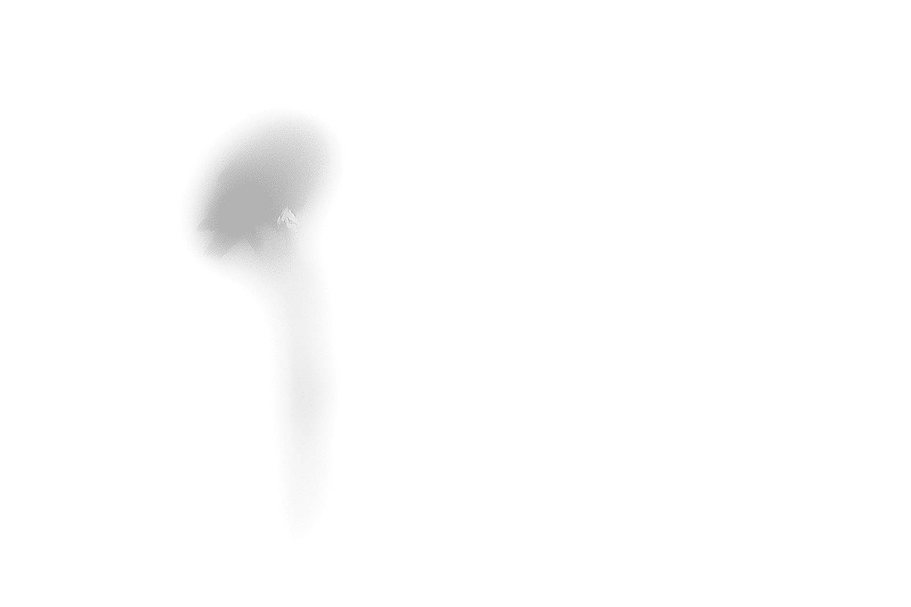

 For details on the nuts and bolts behind this project, see <a href="/post/2021/11/07/random-image-manipulation/" target = "_blank">this post</a>.
 Original image source: https://photos.smugmug.com/photos/i-sGTxCVj/0/X3/i-sGTxCVj-X3.jpg

 {width=100%}

 Transformations performed:

 * Colorize (magick) -> Color: #64cad1 | Opacity 46% 
 * Sketching (sketcher) -> Style: 1 | Lineweight: 6 | Contrast: 10 | Shadow: 0.525222786935046 | Gain: 0.730366589035839 
 * Quantize (magick) -> Max Colors in Image: 5 

The resulting image:

 {width=100%}

