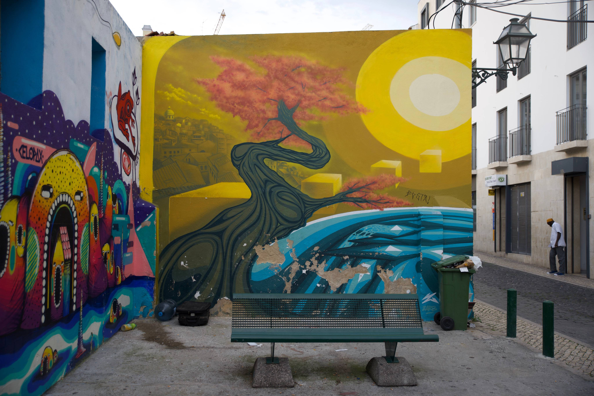
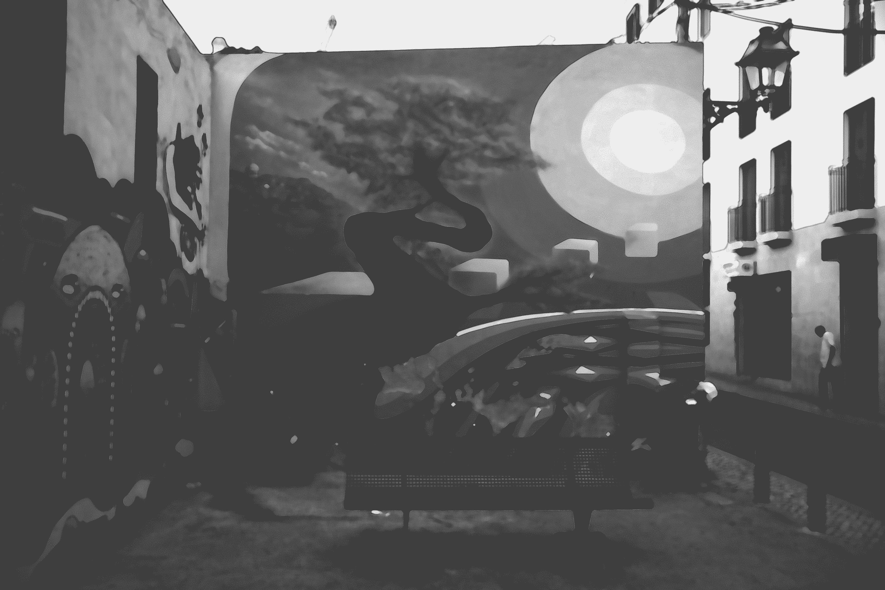

 For details on the nuts and bolts behind this project, see <a href="/post/2021/11/07/random-image-manipulation/" target = "_blank">this post</a>.
 Original image source: https://photos.smugmug.com/photos/i-26fGGsQ/0/5K/i-26fGGsQ-5K.jpg

 {width=100%}

 Transformations performed:

 * Median (magick) -> Pixels: 21 
 * Sketching (sketcher) -> Style: 2 | Lineweight: 1 | Contrast: 18 | Shadow: 0.801950972527266 | Gain: 0.0314881100784987 
 * Quantize (magick) -> Max Colors in Image: 5 

The resulting image:

 {width=100%}

