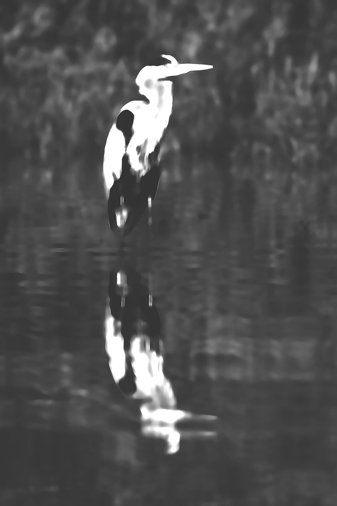

 For details on the nuts and bolts behind this project, see <a href="/post/2021/11/07/random-image-manipulation/" target = "_blank">this post</a>.
 Original image source: https://photos.smugmug.com/photos/i-2bX4dp5/0/X5/i-2bX4dp5-X5.jpg

 {width=100%}

 Transformations performed:

 * Median (magick) -> Pixels: 24 
 * Sketching (sketcher) -> Style: 2 | Lineweight: 2 | Contrast: 11 | Shadow: 0.650303451577201 | Gain: 0.903298538411036 
 * Modulation (magick) -> Brightness: 148 | Saturation: 84 | Hue: 108 

The resulting image:

 {width=100%}

