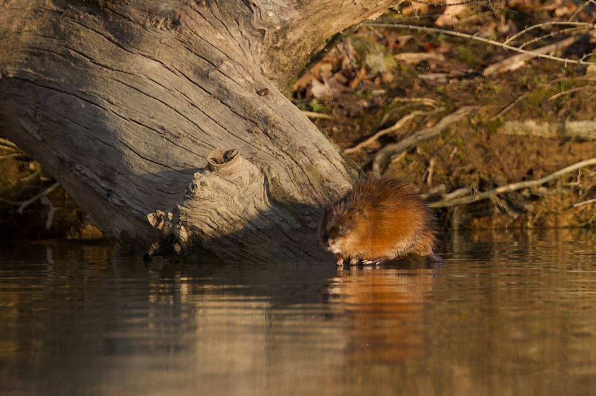
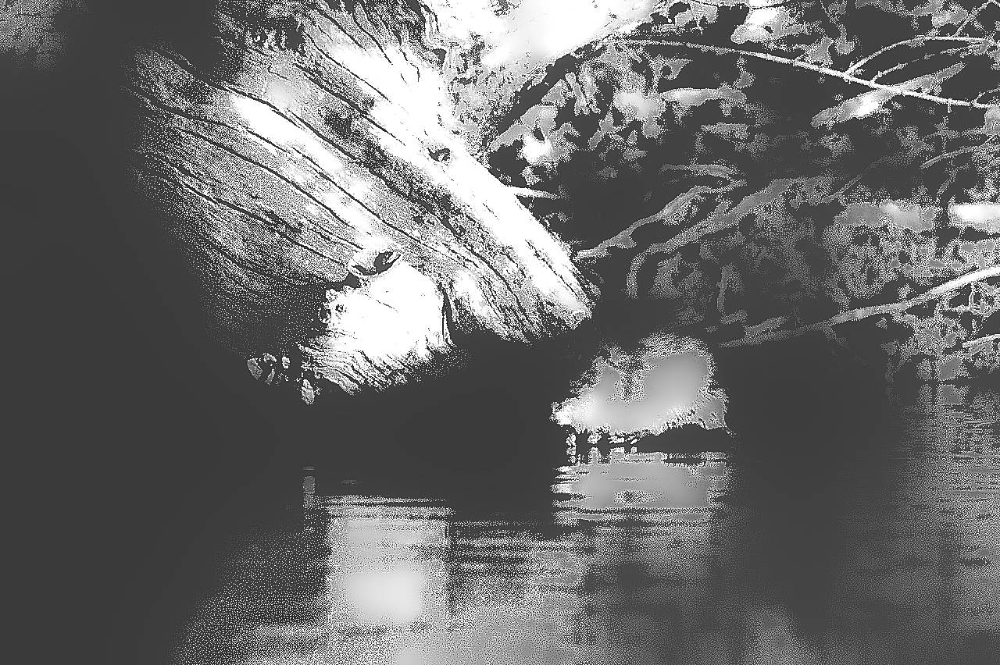

 For details on the nuts and bolts behind this project, see <a href="/post/2021/11/07/random-image-manipulation/" target = "_blank">this post</a>.
 Original image source: https://photos.smugmug.com/photos/i-PGtQ8WF/0/X2/i-PGtQ8WF-X2.jpg

 {width=100%}

 Transformations performed:

 * Quantize (magick) -> Max Colors in Image: 11 
 * Sketching (sketcher) -> Style: 1 | Lineweight: 6 | Contrast: 60 | Shadow: 0.521958182798699 | Gain: 0.992227999260649 

The resulting image:

 {width=100%}

