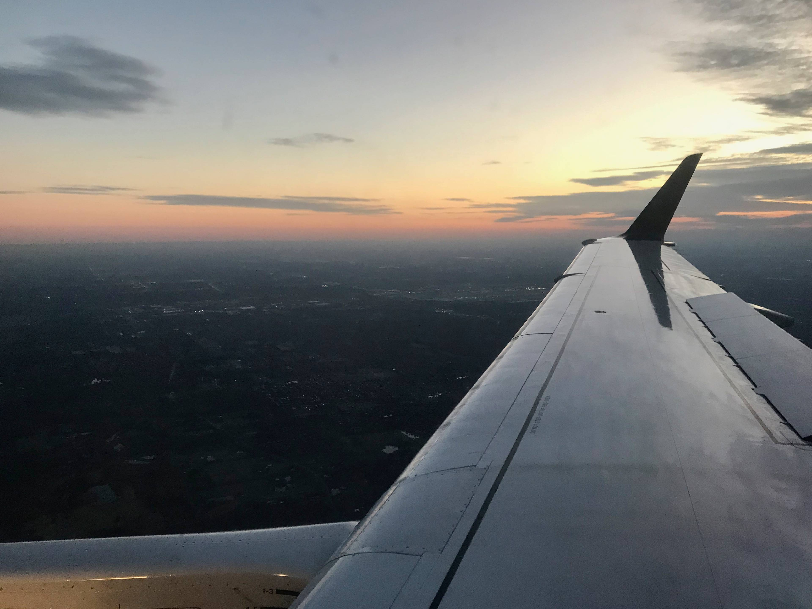
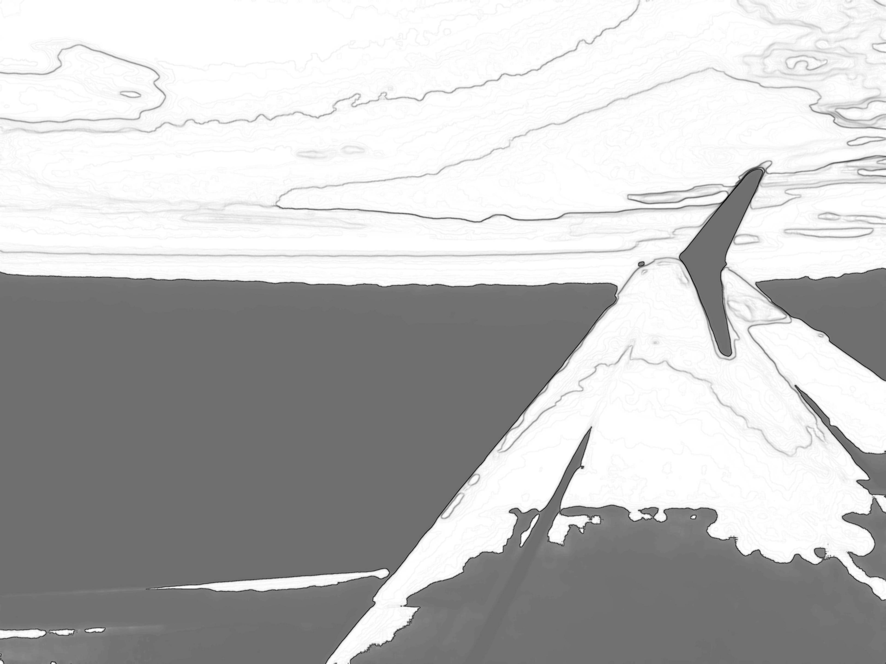

 For details on the nuts and bolts behind this project, see <a href="/post/2021/11/07/random-image-manipulation/" target = "_blank">this post</a>.
 Original image source: https://photos.smugmug.com/photos/i-WpnKMLK/0/4K/i-WpnKMLK-4K.jpg

 {width=100%}

 Transformations performed:

 * Colorize (magick) -> Color: #32f055 | Opacity 30% 
 * Quantize (magick) -> Max Colors in Image: 9 
 * Median (magick) -> Pixels: 37 
 * Sketching (sketcher) -> Style: 2 | Lineweight: 1 | Contrast: 32 | Shadow: 0.509221155196428 | Gain: 0.182274935068563 

The resulting image:

 {width=100%}

