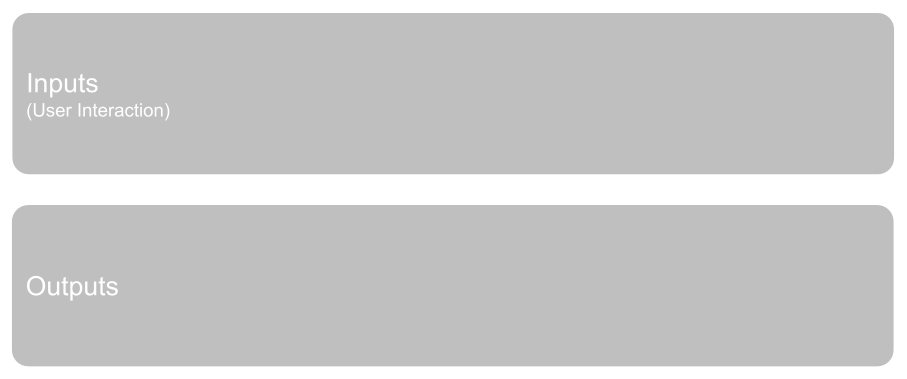
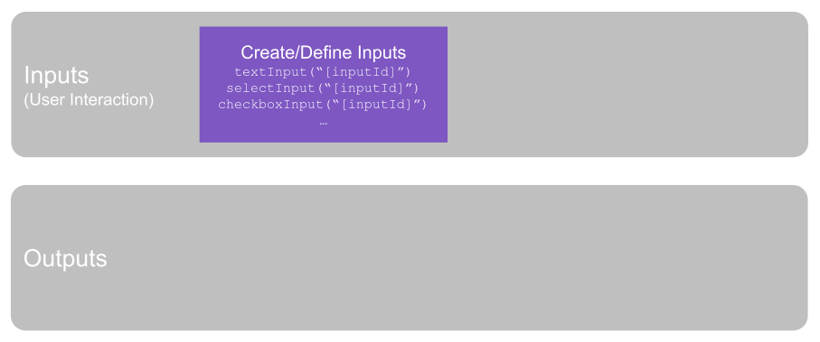
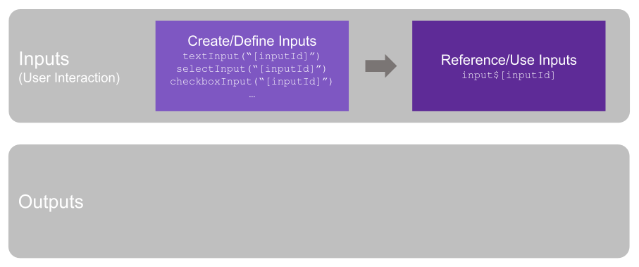
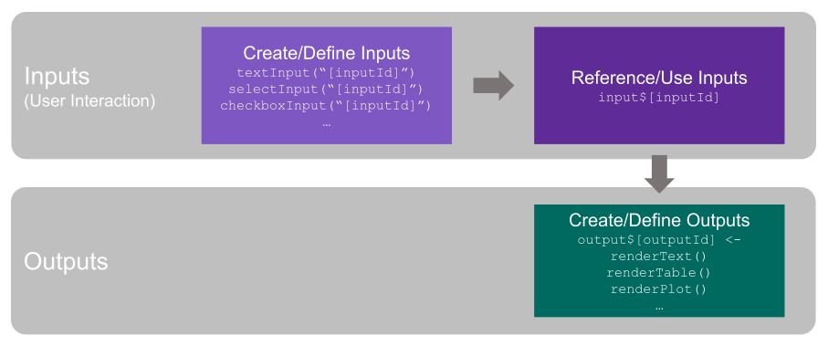
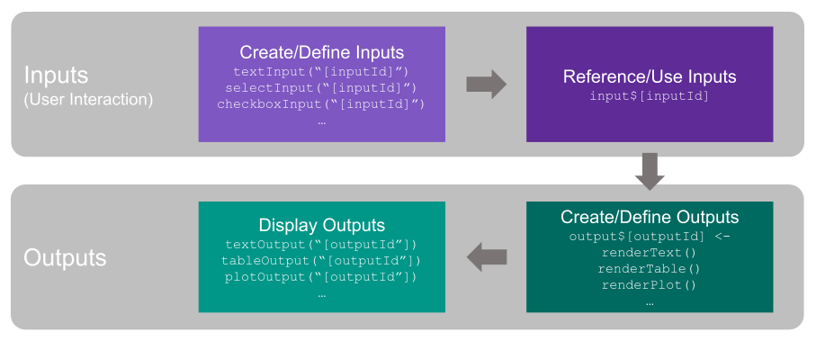
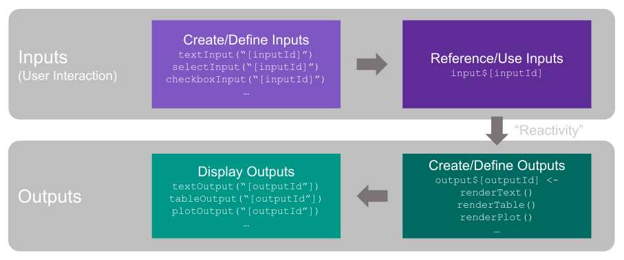
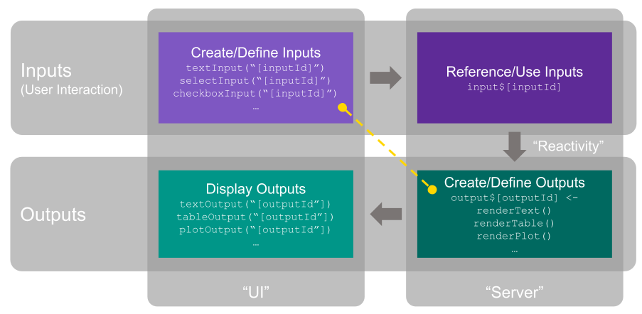

Like many moderately-fluent-but-not-advanced analysts using R, I have something of a tortured relationship with Shiny:

* When I haven't built anything with it in a while, it takes a period of frustration to get the basics of a new Shiny app working and re-remember the ins and outs of reactivity
* Once I've gotten through that period of frustration, I get blissfully lost in the process of tweaking the project and adding functionality and shifting around the layout and experience small waves of euphoria with each passing iteration

A few examples of apps that I created (which you can use as a gauge to the worth of everything that comes after in this post) are:

* [This simulator](https://sdidev.shinyapps.io/randomization_explorer/) that explores how randomization does wonderful things when it comes to observable and unobservable covariates (with the central limit theorem, lurking, unspoken, in the background)
* [This A/B Test Result simulator](https://sdidev.shinyapps.io/test-result-simulator/) that I built because I was really just trying to understand binomial distributions (and, as it happens, also employs the central limit theorem)
* [This Bill Splitter](https://bit.ly/bill-splitter) that wound up being a bit more math (but fun math) behind the scenes than I'd thought it would be when I built it; but, it tries to illustrate the gender pay gap in different countries by providing one tiny way to illustrate and think about it when dining in mixed company

Every time I tackle a new app, I have to refresh my brain on the basics of Shiny. And, recently, when providing an overview of the package to some colleagues, I found myself drawing up a diagram that seemed...useful.

## There Are Plenty of Existing Shiny Resources

This post is by no means attempting to replace the wealth of information at [shiny.rstudio.com](https://shiny.rstudio.com/) and elsewhere. I regularly use the articles and the galleries there for both reference and inspiration. And there is the [R Shiny Cheatsheet](https://raw.githubusercontent.com/rstudio/cheatsheets/main/pngs/shiny.png), which, like many cheatsheets, is most useful as a reference once you have a pretty solid understanding of the underlying material.

And, these days, almost everything I build with Shiny uses [flexdashboard](https://pkgs.rstudio.com/flexdashboard/), and I wind up on the [same post every time](https://rstudio.github.io/flexdashboard/articles/shiny.html) to refresh myself on how to go about incorporating Shiny components into that world. I particularly like the fact that, with flexdashboard apps, I can put the output definitions (server) right next to the actual output display (ui) without having to worry about "server" vs. "ui"...although I think there is real value in having a basic intuition about the "ui" (front-end) of the app versus the "server" (back-end) of the app, which is something that this post addresses!

In short, yes, there are _lots_ of existing resources. This post is simply meant to be a useful addition to that overall corpus.

Let's get to it.

## Starting at the End

Ultimately, this is the "complete" diagram that I came up with:

If you're thinking, "Um...well...duh!" then...great! First, that means it's accurate. But, second, that means you've got intuition and clarity around Shiny that it took me a while to get to.

If you're thinking, "Oh...interesting. That seems a lot simpler than I'd thought things were. Do tell me more!" Well, then it might be useful to build this one piece at a time and describe each piece as we go. And...there's a little bit of a bonus observation at the very end.

## Inputs and Outputs

Let's start with the basic idea of Shiny: it's interactive. This means it's got a stimulus/response paradigm at its core: the inputs are interactions by the user, and the outputs are the result of applying those inputs in some fashion.

## Creating the Inputs

The user interaction is through input controls, and the big (relatively speaking) decisions there are:

* What type of control is it (a checkbox, a dropdown, a slider, etc.)?
* What the options and default values are for the control
* The _name_ of the control. This is the `inputId` that you specify and then reference elsewhere

## Referencing / Using the Inputs

Separate from creating the inputs, you then want to actually _use_ the selected values from them. That's a separate operation, and it's an entirely different syntax—`input$[inputId]`—but, at its core, it's linked back to the appropriate input using whatever `inputId` value you decided on when creating the input.

## Creating Outputs

When it comes to the output—what you actually want to show the user as a result of their selections—things work similarly to inputs, but kind of in a reverse order.

You start by creating/defining the output. The two big things you have to do here are:

* Figure out the _name_ you will use to refer to the output. This is the `outputId` and actually gets defined as `output$[outputId]` (this is the "similar...but in reverse" part when compared to inputs: you actually _set the name_ by putting some value for `outputId` in `output$[outputId]`; remember that, for inputs, when using `input$[inputId]` you are simply _referring to the `inputId` value you had already defined_).

* Figure out the _type of output_ you're creating. Or, the type of output that you're _going to render_. This winds up being defined using a `render...` function: `renderPlot`, `renderText`, etc. It's a _little_ tricky, in that you're not _actually displaying (rendering) anything with this_. You are simply defining what _will be rendered_ for the user in the next step.

The key here is that, since the output will be dynamic based on what the user has selected/set through the inputs, the _inputs_ are actually used in the logic and code that defines the outputs. We'll come back to that very shortly.

## Display the Output

The last piece of the puzzle is actually displaying the resulting output to the user. This is accomplished using the `...Output("[outputId])` functions (`textOutput()`, `plotOutput()`, etc.). The primary argument for each of these functions is simply the `outputId` defined in the previous step.

## The Miracle of Reactivity

You simply cannot develop a healthy and satisfying relationship with Shiny without having a proper level of awe and appreciation for reactivity. You actually...can't read very far on any documentation or tutorial about Shiny without hitting the topic pretty hard. 

Functionally, reactivity is simply the link between the inputs and the outputs: when the user changes an input, all of the affected outputs will automatically reprocess and get updated. There are lots of tips and tricks for tweaking exactly what, how, and where reactivity comes into play. Those are important, but they are beyond the scope of this post. We can make one small addition to the diagram to reflect where reactivity sits (right between the inputs and outputs):

## Front End and Back End

It's useful to add one more layer to the diagram, and that is to recognize that, while we've been looking at it thus far as being two _rows_ of operations, we can also think about it as two _columns_:

* The _left column_ is actually the "front end." It's everything to do with the _user interface_. Or...in developer shorthand, the "UI." And that's why, in the early versions of Shiny, when you had to have two files for a single app, one of them was `ui.R`. That was "the left column." In a "single file Shiny app," you define a `ui` object (by convention) that then gets passed as the value for the `ui` argument in the `shinyApp()` function. In a **flexdashboard** file that is Shiny-enabled...the "UI" concept is just implicitly there, but is never explicitly referenced in the code.

* The _right column_ is the "back end." It's where the actual crunching work happens—where the inputs get embedded into all manner of code so that useful outputs can be defined for rendering. You can think of this as being the "server" that's doing the heavy lifting. You don't _have_ to think of it that way...but Shiny does! In a traditional, two-file Shiny app, the `server.R` file is where everything from the right column goes. In a single-file Shiny app, a `server` object typically gets defined and then used in the  `shinyApp()` function as the value for the `server` argument. Again, in **flexdashboard** this distinction still exists, but it's never explicitly referenced in the code.

And that's really it.

Except...[there's just one more thing](https://www.youtube.com/watch?v=T_d6_CdNEVA)...

## The Symmetry of Diagonal Definitions

It wasn't until I started drawing up the diagram that I fully clicked on a few things. The "rows" (inputs vs outputs) and the "columns" (front end/UI vs. back end/server) were part of that. But there is one other piece that I referenced in passing earlier that I think bears calling out directly.

First, a quick reminder of two basic points:

* The first step for both inputs and outputs is _defining_ them. That's where you give them an ID—an `inputId` for inputs and an `outputId` for outputs.

* This definition occurs in the _front end_ (the UI) for inputs and the _back end_ (the server) for outputs

What's interesting...but I realized can be a little confusing, even though it actually sorta' makes sense, is that the underlying _syntax_ for how those definitions are effected is quite different:

* **Inputs** have their `inputId` values defined _as an argument inside a function_ (one of the `...Input()` functions)

* **Outputs** have their `outputId` values defined _as a value following the dollar sign in an `output$...` object definition_

The _definition_ of inputs and outputs are operations that occur in the "top left" and "bottom right" of our diagram, which, really, is why their syntax is so different.

I think (hope) this is helpful. It certainly has made the picture clearer in my mind as to how these four underlying components work together and how and why the specific syntax of each component falls as it does!
