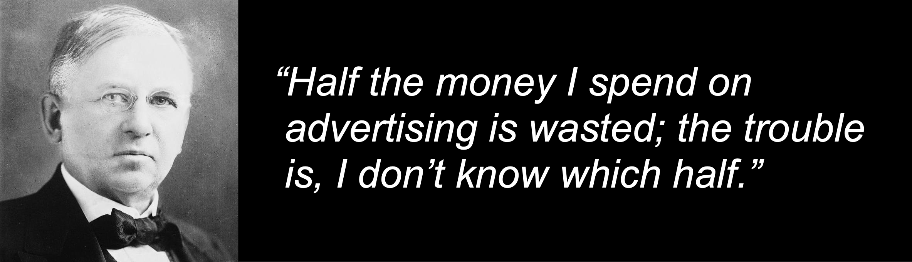

I feel like I've spent well over a decade as a multi-touch attribution skeptic. For years, my rationale could be summed up as follows:

>_Look, it's nice to think that you're getting close to achieving total visbility into your customers' and potential customers' interactions with your brand, but you're not. And you never will. So, please go focus on something that is less of a fool's errand!_

Of late, I've found myself conflicted about this position. On the one hand, it is _absolutely accurate_ that, not only have brands historically been farther from being able to track "all" consumer touchpoints, this is actually getting [steadily worse with each passing browser update](https://cunderwood.dev/category/browser-updates/) (not to mention regulatory changes that are limiting what activity brands are allowed to collect, process, store, and use)!

I've become conflicted, though, because I've started to realize that the term "attribution" has one meaning, but it gets assumed and treated as though it has an entirely different one. And _that_ might actually be the bigger issue!

## Obligatory "In the Beginning" John Wanamaker Reference

Anyone who has been in marketing for more than 12 minutes has heard—and learned to repeat—a quote generally attributed to John Wanamaker during his time as a retailer in Philadelphia in the late 1800s: "Half the money I spend on advertising is wasted; the trouble is I don't know which half."

I often find myself saying, "THIS the attribution problem."

It turns out that, semantically, this is not true: Wannamaker was lamenting a _measurement_ problem, while "attribution," both in a strictly definitional sense and in the way that it gets carried out, is an _assignment_ problem.

## Measurement vs. Assignment?

Stop for a minute and think about the word "attribution." What does it mean, really? The [Google answer box for the term](https://www.google.com/search?q=attribute+definition) (as a verb) is:

>_"regard something as being caused by (someone or something)"_

Attribution is, fundamentally, about a _choice_: we can "regard something" in any way we'd like. We may tell ourselves that the way we've chosen to regard it is the way that it actually _is_, but, technically, that's separate from attribution itself.

Wanamaker's quote, which is a fair stand-in for what marketers are truly hoping to get to, is actually about the _measurement of incremental value_. Let's go [back to Google for a definition of "measure:"](https://www.google.com/search?q=measure+definition)

>_"estimate or assess the extent, quality, value, or effect of (something)"_

Measurement, while it may have to be estimated, is about an actual causal assessment of the _effect_ of something.

## Isn't One a Stand-In for the Other?

Am I heading down a semantic rabbit hole that ends with me peering into my navel? I don't actually think so (but feel free to judge me either way).

Having truly lost count of the number of times that I have been tasked with identifying the "right" attribution model, I think it's fair to say that most marketers (and most analysts supporting them) believe that these two concepts naturally and automatically converge, and that the techniques used for assignment are equally capable as tools of incremental measurement.

This leads to an expectation that there is a "right" attribution model somewhere in the grab-bag of traditional multi-touch attribution choices: last touch, first touch, linear, J-curve, inverse J-curve, U-shaped, time decay (with the "right" half-life), Markov chains, Shapley values, etc. (and let's not forget that, aside from last touch, all of these models have an infinite number of possible lookback windows that can be assigned).

The kicker is that _none_ of these (although Markov chains and Shapley values try, I think) account for counterfactuals very well: what would customers have done in the _absence_ of a given channel or campaign? And _that_, I believe, is really the true essence of Wanamaker's lament, which we could wordsmith accordingly: 

>_"Each of my channels, campaigns, and interactions delivers (or doesn't deliver) some amount of **incremental** value. The trouble is, I don't live in a world where I have an infinite number of parallel universes where I can play out each scenario to know what that is."_

(I know, it doesn't really roll of the tongue or fit nearly as well on a slide.)

Wanamaker had an incremental measurement challenge. Hoping that looking at historical data and _choosing_ the "right" model is simply an exercise in _assigning_ value. Marketers who realize they need to _measure incrementality_ will find themselves asking bigger and more productive questions, and they will find themselves far from the first touch / last touch world of techniques in the process.

## Read Another Attempt at an Explanation...?

Once I realized this distinction, I haven't been able to stop thinking about it. It seems...so simple. Yet, every time I put fingers to keyboard to try to explain it, I feel like I'm trying to definitively explain that air and water are different only to find myself talking about steam.

But, I _have_ tried another explanation (including the "parable of the pizzeria" in the process) in a post on the [Search Discovery blog](https://www.searchdiscovery.com/blog/attribution-modeling-assignment-of-value-or-measurement-of-value/), if you're interested.

